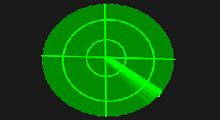

<!DOCTYPE html>
<html lang="en">
<head>
 

  <title>Radar de assalto</title>
  <meta charset="utf-8">
  <meta name="viewport" content="width=device-width, initial-scale=1">
  <link rel="stylesheet" href="https://maxcdn.bootstrapcdn.com/bootstrap/3.3.7/css/bootstrap.min.css">
  <link rel="stylesheet" href="css.css">
  
  

</head>
		<header id="header">
		<body>
		

  <h1>Radar de Assaltos</h1> 
  
Seu trajeto, sem assaltos.
 

  </header>
  

  

  

    

	  	
     <a href="cadastro.html"target="_blank"> <button type="button" class="efeito efeito1 btn btn-success btn-lg btn-block">Cadastre um delito</button></a>  
    

	
	

	  
     <a href="busca.html"target="_blank"> <button type="button" class="efeito efeito1 btn btn-success btn-lg btn-block"><h1>verifique</h1> <h2> seu destino<h2></button></a>
	 
    

        <a href="mapa.png"target="_blank">  <button type="button" class="efeito efeito2 btn btn-success btn-lg btn-block"><h1>Locais com mais </h1><h2>Incidices</h2><h2>de Delitos </h2>  </button></a>
    

	 
    

         <a href="http://www.policiacivil.rs.gov.br/inicial"target="_blank">   <button type="button" class="efeito efeito3 btn btn-success btn-lg btn-block"><h1>BO Polícia Cívil</h1></button></a> 
	

    

	
	

	  	

      <a href="missão.html"target="_blank"> <button type="button" class="efeito efeito4 btn btn-success btn-lg btn-block">Nossa Missão</button></a>  
    

	 
	

  

  

</body>
</html>
